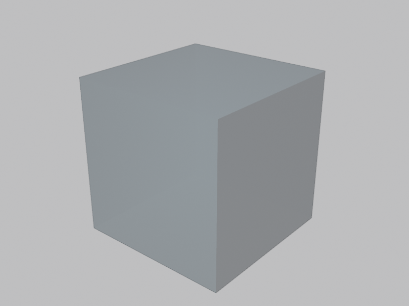
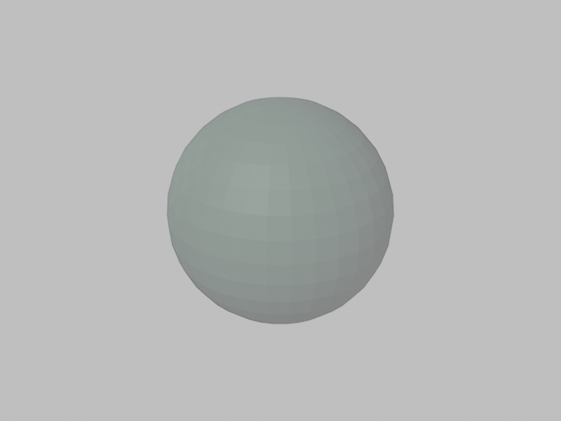
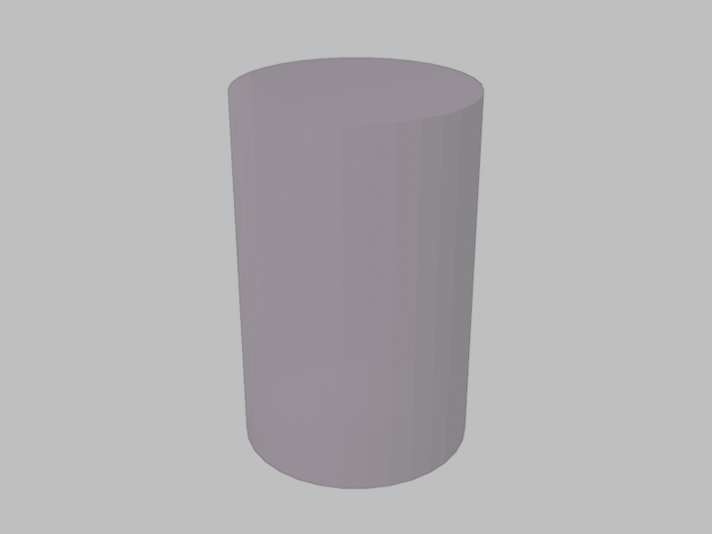
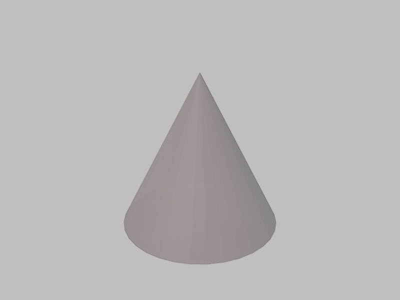
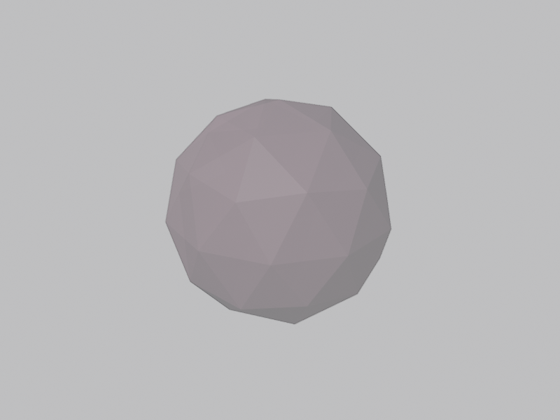
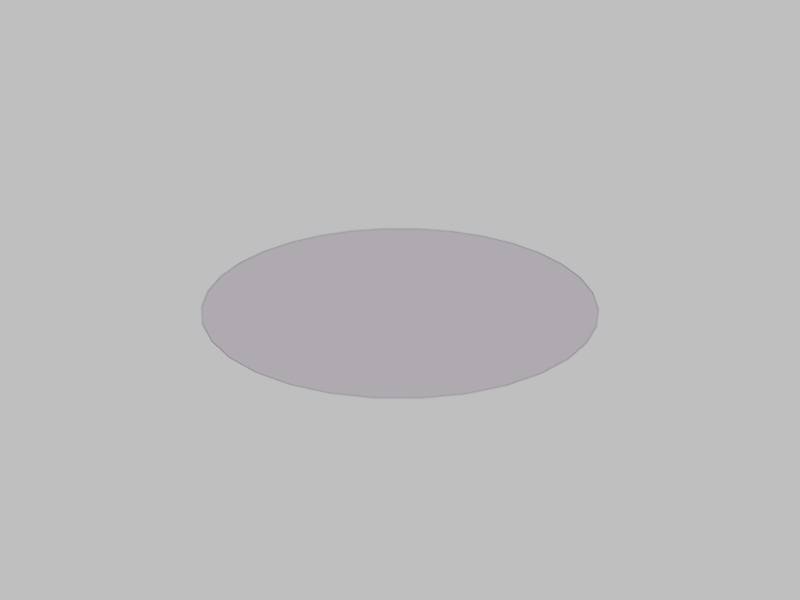
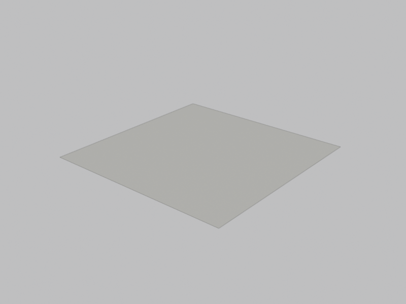
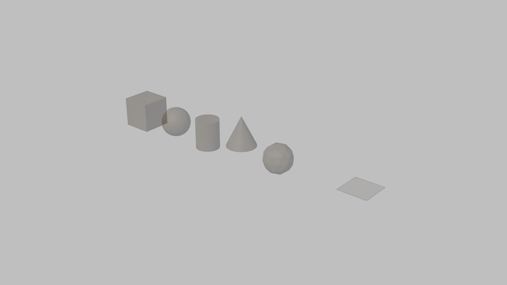

# Tanuki DSL — Module Usage Guide

Complete reference for each DSL module with practical usage examples.

---

## Table of Contents

1. [Context (`context`)](#1-context)
2. [Primitives (`primitives`)](#2-primitives)
3. [Transforms (`transforms`)](#3-transforms)
4. [Operations (`operations`)](#4-operations)
5. [Curves (`curves`)](#5-curves)
6. [Curve Ops (`curve_ops`)](#6-curve-ops)
7. [Mesh Ops (`mesh_ops`)](#7-mesh-ops)
8. [Instancing (`instancing`)](#8-instancing)
9. [Instance Ops (`instance_ops`)](#9-instance-ops)
10. [Material Ops (`material_ops`)](#10-material-ops)
11. [Volume Ops (`volume_ops`)](#11-volume-ops)
12. [Attribute Ops (`attribute_ops`)](#12-attribute-ops)
13. [Other Ops (`other_ops`)](#13-other-ops)
14. [Importers (`importers`)](#14-importers)
15. [Field Nodes (`field_nodes`)](#15-field-nodes)
16. [Math Ops (`math_ops`)](#16-math-ops)
17. [Custom Nodes (`custom`)](#17-custom-nodes)
18. [DSL Patterns](#18-dsl-patterns)

---

## 1. Context

**Module:** `tanuki.dsl.context`

Manages the IR graph lifecycle implicitly using `contextvars` (thread-safe).

### Functions

| Function | Description |
|----------|-------------|
| `model(name)` | Creates a model context. Returns a `ModelContext` (context manager) |
| `output(node)` | Marks a node as the model output and sets it as the graph root |

### Basic Usage

```python
from tanuki import model, output, cube

with model("my_part") as ctx:
    part = cube(10, 10, 10, "base")
    output(part)

graph = ctx.graph  # IRGraph ready to compile
```

Every Tanuki script starts with `model()` and ends with `output()`. Without them the IR graph is not constructed.

---

## 2. Primitives

**Module:** `tanuki.dsl.primitives`

Creates base geometry. All return an `IRPrimitive`.

### Functions

| Function | Signature | Description |
|----------|-----------|-------------|
| `cube` | `(x, y, z, label=None)` | Box with dimensions x, y, z |
| `sphere` | `(r, label=None, segments=32, rings=16)` | UV sphere |
| `cylinder` | `(r, d, label=None, vertices=32)` | Cylinder with radius and depth |
| `cone` | `(r1, r2, d, label=None)` | Cone with top radius, bottom radius, and depth |
| `point` | `(x=0, y=0, z=0, label=None)` | Single point at a position |
| `circle` | `(vertices=32, radius=1.0, fill_type="NONE", label=None)` | Mesh circle |
| `grid` | `(size_x=1, size_y=1, vertices_x=2, vertices_y=2, label=None)` | Flat grid |
| `ico_sphere` | `(radius=1.0, subdivisions=2, label=None)` | Icosphere |
| `line` | `(count=2, start=(0,0,0), end=(0,0,1), label=None)` | Mesh line |

### Visual Reference

> Rendered in Blender 5.0 — **Wireframe** viewport shading, **X-Ray** enabled, **Random** wireframe color.

#### `cube(2, 2, 2)`



#### `sphere(1.0)`



#### `cylinder(0.8, 2.5)`



#### `cone(0.0, 1.0, 2.0)`



#### `ico_sphere(1.0, subdivisions=2)`



#### `circle(vertices=32, radius=1.0, fill_type="NGON")`



#### `grid(size_x=2, size_y=2, vertices_x=6, vertices_y=6)`



#### `line(count=10, start=(0,0,-1), end=(0,0,1))`


### Example

```python
from tanuki import model, output, cube, sphere, cylinder, cone, ico_sphere

with model("primitives") as ctx:
    box = cube(2, 2, 2, "box")
    ball = sphere(1.0, "ball")
    tube = cylinder(0.5, 3.0, "tube")
    tip = cone(0.0, 1.0, 2.0, "tip")
    geo = ico_sphere(1.5, subdivisions=3, label="geo")
    output(box)
```

### Full Showcase — All Primitives

The following example creates every primitive type, translates each along X
so they are visible side by side, and joins them into a single output:

```python
from tanuki.dsl import (
    model, output, join,
    cube, sphere, cylinder, cone, point, circle, grid, ico_sphere, line,
    translate,
)

def create_primitives_showcase():
    with model("primitives_showcase") as ctx:
        spacing = 3.0
        shapes = [
            cube(2, 2, 2, "cube"),
            sphere(1.0, "sphere")             | translate(spacing, 0, 0),
            cylinder(0.8, 2.0, "cylinder")    | translate(spacing * 2, 0, 0),
            cone(0.0, 1.0, 2.0, "cone")      | translate(spacing * 3, 0, 0),
            ico_sphere(1.0, subdivisions=2, label="ico_sphere")
                                              | translate(spacing * 4, 0, 0),
            circle(vertices=32, radius=1.0, label="circle")
                                              | translate(spacing * 5, 0, 0),
            grid(size_x=2, size_y=2, vertices_x=4, vertices_y=4, label="grid")
                                              | translate(spacing * 6, 0, 0),
            line(count=10, start=(0,0,-1), end=(0,0,1), label="line")
                                              | translate(spacing * 7, 0, 0),
        ]
        result = join(shapes)
        output(result)
    return ctx.graph

if __name__ == "__main__":
    from tanuki.backends import render
    graph = create_primitives_showcase()
    render(graph, target="blender", mode="script",
           output_path="primitives_showcase_gen.py")
```

> **Source:** [`blender_docs/examples/primitives_showcase.py`](examples/primitives_showcase.py)

#### Generating a screenshot in Blender

```bash
# 1. Compile the DSL → bpy script
PYTHONPATH=src python blender_docs/examples/primitives_showcase.py

# 2. Render a screenshot (requires Blender in PATH)
blender --background --python blender_docs/examples/blender_screenshot.py -- \
    --script primitives_showcase_gen.py \
    --output blender_docs/images/primitives_showcase.png

# Or use the convenience wrapper:
./blender_docs/examples/run_example_screenshot.sh \
    blender_docs/examples/primitives_showcase.py \
    blender_docs/images/primitives_showcase.png
```



---

## 3. Transforms

**Module:** `tanuki.dsl.transforms`

Position, rotation, and scale transformations. Available in two styles:

- **Curried** (return `Op`): for composition with `|`
- **Direct**: take the node as the first argument

### Curried Functions (return `Op`)

| Function | Signature | Description |
|----------|-----------|-------------|
| `translate` | `(x=0, y=0, z=0)` | Move along x, y, z |
| `rotate` | `(rx=0, ry=0, rz=0)` | Rotate in degrees |
| `scale_by` | `(sx=1, sy=1, sz=1)` | Scale by factors |
| `place` | `(x=0, y=0, z=0)` | Set position offset |

### Direct Functions

| Function | Signature | Description |
|----------|-----------|-------------|
| `transform` | `(node, translation, rotation, scale)` | Full transform in a single call |
| `set_position` | `(node, position)` | Absolute position |

### Utility

| Function | Signature | Description |
|----------|-----------|-------------|
| `pipe` | `(node, *ops)` | Apply a sequence of operations left-to-right |

### Example

```python
from tanuki import model, output, cube, translate, rotate, scale_by, pipe

with model("transforms") as ctx:
    # Pipe operator style
    part = cube(1, 1, 1) | translate(5, 0, 0) | rotate(0, 0, 45) | scale_by(2, 2, 2)

    # Pipe function style
    part2 = pipe(
        cube(1, 1, 1),
        translate(0, 5, 0),
        rotate(90, 0, 0),
    )

    output(part)
```

---

## 4. Operations

**Module:** `tanuki.dsl.operations`

Boolean and geometry join operations.

### Functions

| Function | Signature | Description |
|----------|-----------|-------------|
| `union` | `(nodes)` | Boolean union of multiple nodes |
| `difference` | `(first, rest)` | Subtract `rest` from `first` |
| `intersect` | `(nodes)` | Boolean intersection |
| `join` | `(nodes)` | Combine geometries without boolean operation |

### Example

```python
from tanuki import model, output, cube, sphere, union, difference, intersect, join, translate

with model("booleans") as ctx:
    a = cube(2, 2, 2)
    b = sphere(1.2) | translate(1, 0, 0)

    # Union: merge both
    union_result = union([a, b])

    # Difference: cut b from a
    diff_result = difference(a, [b])

    # Intersection: only the common region
    inter_result = intersect([a, b])

    # Join: combine without merging
    join_result = join([a, b])

    output(diff_result)
```

---

## 5. Curves

**Module:** `tanuki.dsl.curves`

Curve primitives. All return `IRPrimitive`.

### Functions

| Function | Key Parameters | Description |
|----------|----------------|-------------|
| `curve_arc` | `resolution, radius, start_angle, sweep_angle` | Curve arc |
| `curve_circle` | `resolution, radius` | Curve circle |
| `curve_line` | `start, end` | Line between two points |
| `curve_quadrilateral` | `width, height` | Rectangle curve |
| `curve_star` | `points, inner_radius, outer_radius` | Star curve |
| `curve_spiral` | `resolution, rotations, start_radius, end_radius, height` | Spiral |
| `bezier_segment` | `resolution, start, start_handle, end_handle, end` | Cubic Bézier segment |
| `quadratic_bezier` | `resolution, start, middle, end` | Quadratic Bézier |

### Example

```python
from tanuki import model, output, curve_circle, curve_star, curve_spiral, bezier_segment

with model("curves") as ctx:
    ring = curve_circle(resolution=64, radius=2.0)
    star = curve_star(points=5, inner_radius=0.5, outer_radius=1.5)
    spiral = curve_spiral(resolution=128, rotations=3, start_radius=0.5, end_radius=2.0, height=5.0)
    bezier = bezier_segment(
        resolution=32,
        start=(0, 0, 0),
        start_handle=(1, 2, 0),
        end_handle=(3, 2, 0),
        end=(4, 0, 0),
    )
    output(ring)
```

---

## 6. Curve Ops

**Module:** `tanuki.dsl.curve_ops`

Curve operations. All return `Op` (curried for composition with `|`).

### Basic Operations

| Function | Signature | Description |
|----------|-----------|-------------|
| `fill_curve` | `(group_id=0)` | Fill closed curves to create mesh |
| `fillet_curve` | `(count=1, radius=0.1, limit_radius=False)` | Round curve corners |
| `resample_curve` | `(count=10)` | Resample to N points |
| `reverse_curve` | `()` | Reverse direction |
| `subdivide_curve` | `(cuts=1)` | Subdivide segments |
| `trim_curve` | `(start=0.0, end=1.0)` | Trim by factor (0–1) |
| `curve_to_points` | `(count=10)` | Sample points along the curve |
| `deform_curves_on_surface` | `()` | Deform based on surface changes |
| `sample_curve` | `(factor=0.5, curve_index=0)` | Sample data at a position |

### Curve Attributes

| Function | Signature | Description |
|----------|-----------|-------------|
| `set_curve_normal` | `(normal)` | Normal evaluation mode |
| `set_curve_radius` | `(radius)` | Curve point radius |
| `set_curve_tilt` | `(tilt)` | Tilt angle |
| `set_handle_positions` | `(position, offset)` | Bézier handle positions |
| `set_handle_type` | `(handle_type)` | Handle type: `FREE`, `AUTO`, `VECTOR`, `ALIGN` |
| `set_spline_cyclic` | `(cyclic=True)` | Make spline cyclic (closed) |
| `set_spline_resolution` | `(resolution)` | Evaluated-point resolution |
| `set_spline_type` | `(spline_type)` | Type: `CATMULL_ROM`, `POLY`, `BEZIER`, `NURBS` |

### Advanced Operations

| Function | Signature | Description |
|----------|-----------|-------------|
| `edge_paths_to_curves` | `(start_vertices, next_vertex_index)` | Paths across mesh edges |
| `interpolate_curves` | `(guide_up, guide_group_id, points, ...)` | Interpolate between guide curves |
| `points_to_curves` | `(curve_group_id, weight)` | Convert points to curves |
| `curves_to_grease_pencil` | `(instances_as_layers)` | Convert to Grease Pencil |
| `grease_pencil_to_curves` | `(layers_as_instances)` | Convert from Grease Pencil |
| `string_to_curves` | `(string, size, character_spacing, ...)` | Text as curves |

### Example

```python
from tanuki import (
    model, output, curve_circle, curve_line,
    fill_curve, fillet_curve, resample_curve, trim_curve,
    set_spline_cyclic, curve_to_mesh,
)

with model("curve_operations") as ctx:
    # Fill a closed circle
    disc = curve_circle(radius=2.0) | fill_curve()

    # Trim and resample a line
    segment = (
        curve_line(start=(0, 0, 0), end=(10, 0, 0))
        | resample_curve(20)
        | trim_curve(start=0.2, end=0.8)
    )

    # Create a tube from a circular profile
    profile = curve_circle(resolution=8, radius=0.3)
    path = curve_line(start=(0, 0, 0), end=(0, 0, 5))
    tube = path | curve_to_mesh(profile=profile)

    output(tube)
```

---

## 7. Mesh Ops

**Module:** `tanuki.dsl.mesh_ops`

Mesh operations. All return `Op`.

### Functions

| Function | Signature | Description |
|----------|-----------|-------------|
| `extrude` | `(offset_scale=1.0, individual=False)` | Extrude faces |
| `subdivide` | `(level=1)` | Subdivide mesh |
| `subdivide_surface` | `(level=1)` | Smooth subdivision (Catmull-Clark) |
| `set_shade_smooth` | `(shade_smooth=True)` | Toggle smooth shading |
| `merge_by_distance` | `(distance=0.001)` | Merge nearby vertices |
| `dual_mesh` | `(keep_boundaries=False)` | Generate dual mesh |
| `mesh_to_curve` | `()` | Convert edges to curves |
| `mesh_to_points` | `(radius=0.05, mode="VERTICES")` | Convert to point cloud |
| `mesh_to_volume` | `(density, voxel_size, voxel_amount, interior_band_width)` | Convert to volume |
| `volume_to_mesh` | `(threshold, adaptivity, voxel_size, voxel_amount)` | Convert volume to mesh |
| `set_mesh_normal` | `(remove_custom, edge_sharpness, face_sharpness)` | Configure normals |
| `curve_to_mesh` | `(profile=None, scale=1.0, fill_caps=False)` | Convert curve to 3D mesh (with optional profile) |

### Example

```python
from tanuki import (
    model, output, cube,
    extrude, subdivide_surface, set_shade_smooth, merge_by_distance, dual_mesh,
)

with model("mesh_operations") as ctx:
    # Cube with smooth subdivision and shading
    part = (
        cube(2, 2, 2)
        | subdivide_surface(level=2)
        | set_shade_smooth()
    )

    # Extrude + merge nearby vertices
    part2 = (
        cube(1, 1, 1)
        | extrude(offset_scale=0.5, individual=True)
        | merge_by_distance(distance=0.01)
    )

    # Dual mesh for Voronoi-like patterns
    voronoi = cube(2, 2, 2) | subdivide(level=3) | dual_mesh()

    output(part)
```

---

## 8. Instancing

**Module:** `tanuki.dsl.instancing`

Geometry instancing at multiple points.

### Functions

| Function | Signature | Description |
|----------|-----------|-------------|
| `clones` | `(node, points)` | Place instances of `node` at each position in the `points` list |

### Example

```python
from tanuki import model, output, sphere, clones

with model("instances") as ctx:
    ball = sphere(0.3)

    # Create copies at specific positions
    pattern = clones(ball, [
        (0, 0, 0),
        (2, 0, 0),
        (4, 0, 0),
        (0, 2, 0),
        (2, 2, 0),
    ])

    output(pattern)
```

---

## 9. Instance Ops

**Module:** `tanuki.dsl.instance_ops`

Instance operations. All return `Op`.

### Functions

| Function | Signature | Description |
|----------|-----------|-------------|
| `realize_instances` | `()` | Convert instances to real geometry |
| `rotate_instances` | `(rx=0, ry=0, rz=0)` | Rotate instances (degrees) |
| `scale_instances` | `(sx=1, sy=1, sz=1)` | Scale instances |
| `translate_instances` | `(x=0, y=0, z=0)` | Move instances |
| `geometry_to_instance` | `()` | Convert geometry to instance |
| `instances_to_points` | `(position=None, radius=0.05)` | Generate points at instance origins |
| `split_to_instances` | `(group_id=0)` | Split by group ID into separate instances |

### Example

```python
from tanuki import (
    model, output, cube, sphere, clones,
    rotate_instances, scale_instances, realize_instances,
)

with model("instance_ops") as ctx:
    pattern = clones(cube(0.5, 0.5, 0.5), [(i * 2, 0, 0) for i in range(5)])

    # Rotate and scale all instances
    result = (
        pattern
        | rotate_instances(0, 0, 45)
        | scale_instances(1.5, 1.5, 1.5)
        | realize_instances()  # Materialize to real geometry
    )

    output(result)
```

---

## 10. Material Ops

**Module:** `tanuki.dsl.material_ops`

Material assignment and manipulation. All return `Op`.

### Functions

| Function | Signature | Description |
|----------|-----------|-------------|
| `set_material` | `(material)` | Assign a material by name |
| `replace_material` | `(old, new)` | Replace one material with another |
| `set_material_index` | `(material_index)` | Set the material index |

### Example

```python
from tanuki import model, output, cube, set_material, replace_material

with model("materials") as ctx:
    part = cube(2, 2, 2) | set_material("Wood")

    # Later, swap materials
    metal_part = part | replace_material("Wood", "Metal")

    output(metal_part)
```

---

## 11. Volume Ops

**Module:** `tanuki.dsl.volume_ops`

Volume operations. Full coverage (3/3 Blender nodes).

### Functions

| Function | Signature | Returns | Description |
|----------|-----------|---------|-------------|
| `distribute_points_in_volume` | `(density, seed, spacing, threshold)` | `Op` | Generate points inside a volume |
| `points_to_volume` | `(density, voxel_size, voxel_amount, radius)` | `Op` | Create volume from point cloud |
| `volume_cube` | `(density, background, min, max, resolution_x/y/z, label)` | `IRPrimitive` | Dense volume cube primitive |

### Example

```python
from tanuki import (
    model, output, cube, sphere,
    mesh_to_volume, volume_to_mesh, distribute_points_in_volume, volume_cube,
)

with model("volumes") as ctx:
    # Convert mesh to volume and back (volumetric smoothing)
    smooth = (
        cube(2, 2, 2)
        | mesh_to_volume(density=1.0, voxel_size=0.1)
        | volume_to_mesh(threshold=0.5)
    )

    # Create a volume primitive
    vol = volume_cube(density=1.0, background=0.0, min=(-1, -1, -1), max=(1, 1, 1))

    output(smooth)
```

---

## 12. Attribute Ops

**Module:** `tanuki.dsl.attribute_ops`

Named attribute management. Return `Op`.

### Functions

| Function | Signature | Description |
|----------|-----------|-------------|
| `store_named_attribute` | `(name, value, data_type="FLOAT", domain="POINT")` | Store a value in a named attribute |
| `remove_named_attribute` | `(name)` | Remove a named attribute |

### Example

```python
from tanuki import model, output, cube, store_named_attribute, remove_named_attribute

with model("attributes") as ctx:
    part = (
        cube(2, 2, 2)
        | store_named_attribute("weight", 1.5, data_type="FLOAT", domain="POINT")
        | store_named_attribute("color_id", 3, data_type="INT", domain="FACE")
    )

    # Clean up an attribute
    clean = part | remove_named_attribute("color_id")

    output(part)
```

---

## 13. Other Ops

**Module:** `tanuki.dsl.other_ops`

Miscellaneous operations (topology, queries, Grease Pencil, control flow). All return `Op` unless noted otherwise.

### Topology

| Function | Signature | Description |
|----------|-----------|-------------|
| `convex_hull` | `()` | Compute convex hull |
| `delete_geometry` | `(mode, domain)` | Remove selected elements |
| `distribute_points_on_faces` | `(density, density_max, density_factor, distance_min, seed, distribute_method)` | Distribute points on faces |
| `duplicate_elements` | `(amount, domain)` | Duplicate elements |
| `flip_faces` | `()` | Reverse face normals |
| `scale_elements` | `(scale, center, axis, domain, scale_mode)` | Scale faces/edges |
| `split_edges` | `()` | Split mesh edges |
| `triangulate` | `(quad_method, ngon_method)` | Convert to triangles |

### Geometry Info

| Function | Signature | Description |
|----------|-----------|-------------|
| `bounding_box` | `(use_radius=False)` | Compute bounding box |
| `separate_components` | `(component)` | Separate into Mesh, Curve, Grease Pencil, Point Cloud, Volume, Instances |
| `separate_geometry` | `()` | Separate by selection |

### Element Properties

| Function | Signature | Description |
|----------|-----------|-------------|
| `set_id` | `(id_value)` | Set ID attribute |
| `set_point_radius` | `(radius)` | Set point cloud radius |
| `sort_elements` | `(sort_weight, group_id, domain)` | Sort by weight |
| `points_to_vertices` | `()` | Point cloud to mesh vertices |

### Naming & Selection

| Function | Signature | Description |
|----------|-----------|-------------|
| `set_geometry_name` | `(name)` | Label the geometry |
| `set_face_set` | `(face_set)` | Set sculpt face set |
| `set_selection` | `(domain, selection_type)` | Set selection |

### Grease Pencil

| Function | Signature | Description |
|----------|-----------|-------------|
| `merge_layers` | `(mode, group_id)` | Join layers |
| `set_grease_pencil_depth` | `(depth_order)` | Set depth order (2D/3D) |
| `set_grease_pencil_softness` | `(softness)` | Set softness attribute |
| `set_grease_pencil_color` | `(color, opacity)` | Set color and opacity |

### Control Flow

| Function | Signature | Description |
|----------|-----------|-------------|
| `switch` | `(switch_value, true_child)` | Conditional geometry branch |
| `get_named_grid` | `(name, remove, data_type)` | Retrieve named volume grid |
| `store_named_grid` | `(name, grid_value, data_type)` | Store grid data |
| `viewer` | `(value, data_type, domain)` | Debug visualization (pass-through) |

### Query & Sampling

| Function | Signature | Description |
|----------|-----------|-------------|
| `curve_length` | `()` | Total spline length |
| `domain_size` | `()` | Count elements per domain |
| `geometry_proximity` | `(target_element, sample_position, ...)` | Closest location on target |
| `sample_nearest` | `(domain, sample_position)` | Find closest element |
| `sample_index` | `(value, index, data_type, domain, clamp)` | Retrieve by index |
| `attribute_statistic` | `(attribute, data_type, domain)` | Compute statistics (mean, median, sum) |
| `raycast` | `(attribute, source_position, ray_direction, ray_length, data_type)` | Cast rays and retrieve hits |
| `sample_nearest_surface` | `(value, sample_position, data_type, ...)` | Interpolate mesh attribute at closest surface |
| `sample_uv_surface` | `(value, uv_map, sample_uv, data_type)` | Interpolate at UV coordinate |

### Grid Conversion

| Function | Signature | Description |
|----------|-----------|-------------|
| `mesh_to_sdf_grid` | `(voxel_size, band_width)` | Signed distance field grid |
| `mesh_to_density_grid` | `(density, voxel_size, gradient_width)` | Volumetric density grid |

### Example

```python
from tanuki import (
    model, output, cube, sphere,
    distribute_points_on_faces, convex_hull, triangulate,
    set_geometry_name, bounding_box, flip_faces,
)

with model("other_ops") as ctx:
    # Distribute points on cube faces
    points = cube(2, 2, 2) | distribute_points_on_faces(density=10.0, seed=42)

    # Convex hull of a sphere
    hull = sphere(2.0) | convex_hull()

    # Triangulate and name
    tri = (
        cube(3, 3, 3)
        | triangulate()
        | set_geometry_name("triangulated_cube")
    )

    output(tri)
```

---

## 14. Importers

**Module:** `tanuki.dsl.importers`

External file importers and Blender object/collection references. Return `IRPrimitive`.

### File Importers

| Function | Signature | Description |
|----------|-----------|-------------|
| `import_obj` | `(path)` | Import OBJ file |
| `import_stl` | `(path)` | Import STL file |
| `import_ply` | `(path)` | Import PLY file |
| `import_csv` | `(path, delimiter=",")` | Import CSV point cloud |
| `import_vdb` | `(path)` | Import VDB volume |

### Blender References

| Function | Signature | Description |
|----------|-----------|-------------|
| `collection_info` | `(collection, separate_children, reset_children, transform_space)` | Reference a Blender collection |
| `object_info` | `(object, as_instance, transform_space)` | Reference a Blender object |

### Example

```python
from tanuki import model, output, import_obj, import_stl, translate

with model("imports") as ctx:
    # Import external models
    casing = import_obj("/path/to/casing.obj") | translate(0, 0, 1)
    bracket = import_stl("/path/to/bracket.stl")

    output(casing)
```

---

## 15. Field Nodes

**Module:** `tanuki.dsl.field_nodes`

Field nodes produce per-element values (scalar, vector, integer) evaluated in the Geometry Nodes context. They have **no geometry input** — they are wired into input sockets of other nodes. All return an `IRFieldInput`.

### Functions

| Function | Blender Node | Output | Description |
|----------|-------------|--------|-------------|
| `position()` | Input Position | Vector | Per-element position |
| `normal()` | Input Normal | Vector | Per-face/vertex normal |
| `index()` | Index | Integer | Per-element index (0, 1, 2, …) |
| `id_field()` | ID | Integer | Per-element ID attribute |
| `edge_vertices(output)` | Edge Vertices | Vector/Int | Vertex positions and indices of each edge |
| `edge_angle(unsigned)` | Edge Angle | Float | Angle between two faces sharing an edge |
| `vertex_neighbors(output)` | Vertex Neighbors | Integer | Connected vertices/faces count per vertex |
| `face_neighbors(output)` | Face Neighbors | Integer | Connected vertices/faces count per face |
| `face_area()` | Face Area | Float | Area of each face |
| `edge_neighbors()` | Edge Neighbors | Integer | Number of faces connected to each edge |
| `mesh_island(output)` | Mesh Island | Integer | Island index and total count |
| `named_attribute(name, data_type)` | Named Attribute | Varies | Read a named attribute from geometry |

### Usage

```python
from tanuki import *

# Field nodes are used as inputs to math ops or geometry ops
pos = position()          # Per-element position vector
ang = edge_angle()        # Unsigned angle between adjacent faces
p1 = edge_vertices("Position 1")  # First vertex position of each edge
p2 = edge_vertices("Position 2")  # Second vertex position of each edge
```

### Output Socket Selection

Some field nodes have multiple output sockets. Use the `output` parameter:

```python
edge_vertices("Position 1")     # First vertex position
edge_vertices("Position 2")     # Second vertex position
edge_vertices("Vertex Index 1") # First vertex index
edge_vertices("Vertex Index 2") # Second vertex index

vertex_neighbors("Vertex Count") # Number of connected vertices
vertex_neighbors("Face Count")   # Number of connected faces

edge_angle(unsigned=True)   # Always positive angle
edge_angle(unsigned=False)  # Includes concavity sign
```

---

## 16. Math Ops

**Module:** `tanuki.dsl.math_ops`

Scalar and vector math operations mirroring Blender's `ShaderNodeMath` and `ShaderNodeVectorMath`. All return an `IRMathOp` which produces field values that can be wired into geometry inputs.

### Scalar Math

| Function | Operation | Description |
|----------|-----------|-------------|
| `math_add(a, b)` | ADD | `a + b` |
| `math_subtract(a, b)` | SUBTRACT | `a - b` |
| `math_multiply(a, b)` | MULTIPLY | `a * b` |
| `math_divide(a, b)` | DIVIDE | `a / b` |
| `math_power(base, exp)` | POWER | `base ** exp` |
| `math_sqrt(a)` | SQRT | Square root |
| `math_absolute(a)` | ABSOLUTE | Absolute value |
| `math_minimum(a, b)` | MINIMUM | `min(a, b)` |
| `math_maximum(a, b)` | MAXIMUM | `max(a, b)` |
| `math_less_than(a, b)` | LESS_THAN | `1.0 if a < b else 0.0` |
| `math_greater_than(a, b)` | GREATER_THAN | `1.0 if a > b else 0.0` |
| `math_sin(a)` | SINE | Sine (radians) |
| `math_cos(a)` | COSINE | Cosine (radians) |
| `math_tan(a)` | TANGENT | Tangent (radians) |
| `math_arctan2(a, b)` | ARCTAN2 | `atan2(a, b)` |
| `math_floor(a)` | FLOOR | Floor |
| `math_ceil(a)` | CEIL | Ceiling |
| `math_round(a)` | ROUND | Round |
| `math_modulo(a, b)` | MODULO | Modulo |

### Vector Math

| Function | Operation | Output | Description |
|----------|-----------|--------|-------------|
| `vec_add(a, b)` | ADD | Vector | Component-wise add |
| `vec_subtract(a, b)` | SUBTRACT | Vector | Component-wise subtract |
| `vec_multiply(a, b)` | MULTIPLY | Vector | Component-wise multiply |
| `vec_divide(a, b)` | DIVIDE | Vector | Component-wise divide |
| `vec_cross(a, b)` | CROSS_PRODUCT | Vector | Cross product |
| `vec_dot(a, b)` | DOT_PRODUCT | **Scalar** | Dot product |
| `vec_normalize(a)` | NORMALIZE | Vector | Normalize to unit length |
| `vec_length(a)` | LENGTH | **Scalar** | Vector length |
| `vec_distance(a, b)` | DISTANCE | **Scalar** | Distance between vectors |
| `vec_scale(vec, scale)` | SCALE | Vector | Scale vector by scalar |
| `vec_project(a, b)` | PROJECT | Vector | Project *a* onto *b* |
| `vec_reflect(a, b)` | REFLECT | Vector | Reflect *a* around *b* |
| `vec_faceforward(a, b, c)` | FACEFORWARD | Vector | Faceforward |
| `vec_minimum(a, b)` | MINIMUM | Vector | Component-wise min |
| `vec_maximum(a, b)` | MAXIMUM | Vector | Component-wise max |
| `vec_floor(a)` | FLOOR | Vector | Component-wise floor |
| `vec_ceil(a)` | CEIL | Vector | Component-wise ceil |
| `vec_absolute(a)` | ABSOLUTE | Vector | Component-wise abs |
| `vec_sin(a)` | SINE | Vector | Component-wise sin |
| `vec_cos(a)` | COSINE | Vector | Component-wise cos |
| `vec_tan(a)` | TANGENT | Vector | Component-wise tan |

### Usage

```python
from tanuki import *

# Compute direction between two edge vertices
p1 = edge_vertices("Position 1")
p2 = edge_vertices("Position 2")
direction = vec_normalize(vec_subtract(p2, p1))

# Scale to a specific length
from tanuki.ir.nodes import IRValue
length = IRValue(value=0.5, label="arm_length")
arm = vec_scale(direction, length)

# Scalar math on field values
angle = edge_angle()
half_angle = math_divide(angle, IRValue(value=2.0, label="two"))
```

> Note: `vec_dot`, `vec_length`, and `vec_distance` produce **scalar** outputs. The compiler resolves this automatically via `_VECTOR_MATH_SCALAR_OUT`.

---

## 17. Custom Nodes

**Module:** `tanuki.dsl.custom`

Custom composite nodes are high-level operations built by composing existing DSL primitives, field nodes, and math ops. They live in `src/tanuki/dsl/custom/` and follow the same `Op = Callable[[IRNode], IRNode]` pattern.

### Mesh Analysis (`tanuki.dsl.custom.mesh_analysis`)

Analysis and visualization of mesh topology — edges, faces, and vertex angles.

| Function | Returns | Description |
|----------|---------|-------------|
| `edges_group()` | Op | Converts mesh edges to curves (via `MeshToCurve`) |
| `faces_group()` | Op | Returns mesh as-is (semantic pass-through) |
| `angles_group(arm_length)` | Op | Per-edge points with direction arm vectors and dihedral angle as named attributes |
| `mesh_analysis(mesh, arm_length)` | IRJoin | Combines edges + faces + angles into one geometry |

### How `angles_group` works

The angle visualization builds the following field/math graph per edge:

1. `edge_vertices("Position 1")` + `edge_vertices("Position 2")` → vertex positions
2. `vec_subtract` → direction vectors `P2–P1` and `P1–P2`
3. `vec_normalize` → unit direction vectors
4. `vec_scale(dir, arm_length)` → scaled arm vectors
5. `MeshToPoints(mode=EDGES)` → one point per edge
6. `StoreNamedAttribute` × 3:
   - `_arm_dir_1` (vector) — direction arm from vertex 1
   - `_arm_dir_2` (vector) — direction arm from vertex 2
   - `_edge_angle` (float) — unsigned dihedral angle

### Usage

```python
from tanuki import *
from tanuki.dsl.custom import mesh_analysis, edges_group, angles_group

# Full analysis — three groups joined
with model("full_analysis") as ctx:
    base = cube(2, 2, 2, "box")
    result = mesh_analysis(base, arm_length=0.3)
    output(result)

# Or use individual groups with piping
with model("edges_only") as ctx:
    base = ico_sphere(1.0, subdivisions=2, label="sphere")
    edges = base | edges_group()
    output(edges)

# Angle arms on a complex mesh
with model("angle_arms") as ctx:
    base = cube(2, 2, 2, "box") | subdivide(level=2)
    arms = base | angles_group(arm_length=0.5)
    output(arms)
```

### Creating Your Own Custom Nodes

To add a new custom node:

1. Create a `.py` file in `src/tanuki/dsl/custom/`
2. Import from `tanuki.dsl` and `tanuki.ir.nodes` as needed
3. Define functions that return `Op` (for piping) or `IRNode` (for direct use)
4. Re-export from `custom/__init__.py`

```python
# src/tanuki/dsl/custom/my_node.py
from collections.abc import Callable
from ...ir.nodes import IRGeometryOp, IRNode

Op = Callable[[IRNode], IRNode]

def my_custom_op(param: float = 1.0) -> Op:
    def _apply(node: IRNode) -> IRNode:
        # Compose existing DSL operations here
        ...
    return _apply
```

---

## 18. DSL Patterns

### All functions are pure

They don't mutate state. They return IR nodes that form a graph.

### Curried ops and piping

Most functions return `Op = Callable[[IRNode], IRNode]`. They compose with `|`:

```python
result = box | translate(1, 0, 0) | rotate(0, 0, 45) | extrude(0.5)
```

### Labels for debugging

Nearly all constructors accept an optional `label`:

```python
base = cube(10, 10, 2, label="base_plate")
```

### Implicit context

`model()` and `output()` manage the IR graph without passing it explicitly:

```python
with model("name") as ctx:
    # build geometry...
    output(final_node)
graph = ctx.graph
```

### Typical complete workflow

```python
from tanuki import *

with model("full_example") as ctx:
    # 1. Create primitives
    base = cube(10, 10, 2, "base")
    column = cylinder(0.5, 8, "column")

    # 2. Transform
    column = column | translate(0, 0, 5)

    # 3. Mesh operations
    base = base | subdivide_surface(level=2) | set_shade_smooth()

    # 4. Combine
    structure = join([base, column])

    # 5. Material
    structure = structure | set_material("Concrete")

    # 6. Output
    output(structure)

graph = ctx.graph
```

---

## Current Coverage

| Category | Implemented | Total | % |
|----------|-------------|-------|---|
| Mesh Nodes | 20 | 22 | 91% |
| Curve Nodes | 33 | 45 | 73% |
| Instances Nodes | 8 | 13 | 62% |
| Transform Nodes | 1 | 3 | 33% |
| Attribute Nodes | 4 | 6 | 67% |
| Material Nodes | 3 | 4 | 75% |
| Volume Nodes | 3 | 3 | 100% |
| Color Nodes | 1 | 1 | 100% |
| Field Nodes | 13 | 37 | 35% |
| Output Nodes | 0 | 4 | 0% |
| Texture Nodes | 0 | 1 | 0% |
| Other Nodes | 50 | 97 | 52% |
| Math Nodes | 11 | 11 | 100% |
| Custom Nodes | 4 | — | — |
| **Total** | **~140** | **223** | **~63%** |
