# Stencil Lab — Visual Tutorial

A hands-on tour of **every option** in the Stencil Lab, worked end-to-end on one
photo: `tanuki.jpg` (a Japanese raccoon dog — the project's namesake).

Every image below is generated by [`generate_tutorial.py`](generate_tutorial.py)
straight from the code, so it always matches the current behaviour:

```bash
cd src && PYTHONPATH=. python tanuki/mori/stencil_lab/docs/generate_tutorial.py
```

The pipeline we're following:

```
Image → Adjustments → Colour Separation → Pattern → (Fabrication) → Export
                                                          ↑
                                          Registration · Tiling
```

For the API reference and parameter lists, see [`usage.md`](usage.md). This file
is about *seeing* what each knob does.

---

## 0. The example image

```python
from tanuki.mori import stencil_lab as sl

rgb  = sl.resize(sl.load_image("tanuki.jpg"), max_side=440)  # float [0,1]
gray = sl.to_grayscale(rgb)     # tone:     0 = black, 1 = white
cov  = sl.coverage(rgb)         # ink:      1 - tone  (dark = more ink)
```

| Source (RGB) | Grayscale *tone* | Coverage (ink) |
|:---:|:---:|:---:|
| 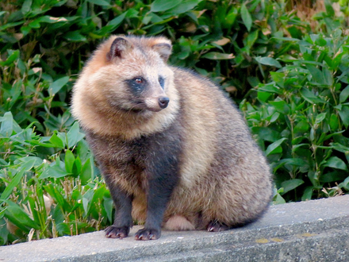 |  |  |

Everything downstream is driven by **coverage**: where the image is dark, the
pattern lays down more ink (bigger dots, thicker lines, denser cells).

---

## 1. Image adjustments

Shape the tone *before* screening. Each call returns a new array in `[0, 1]`;
nothing is mutated. (Shown applied to the grayscale image.)

```python
from tanuki.mori.stencil_lab import adjustments as adj
```

| | | |
|:---:|:---:|:---:|
| **brightness** `+0.25` | **contrast** `×1.8` | **gamma** `0.45` |
| 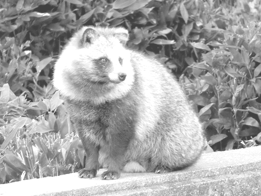 | 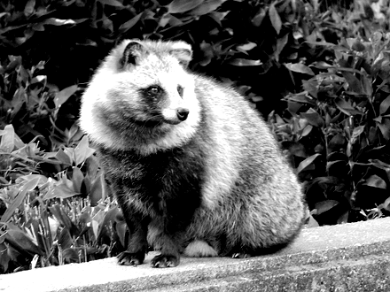 |  |
| `adj.brightness(g, 0.25)` | `adj.contrast(g, 1.8)` | `adj.gamma(g, 0.45)` |
| **invert** | **threshold** `0.5` | **posterize** `4` |
| 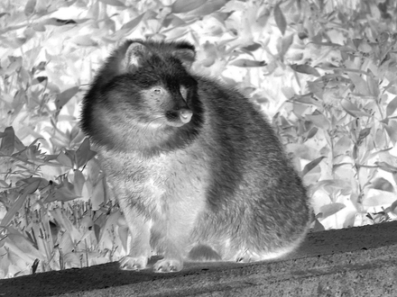 | 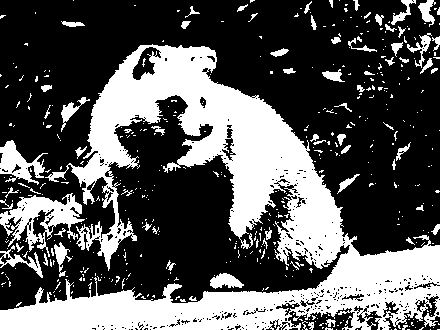 | 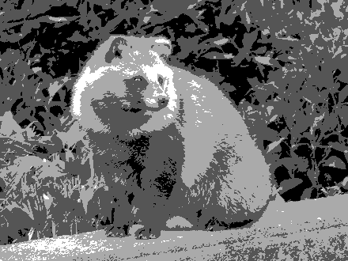 |
| `adj.invert(g)` | `adj.threshold(g, 0.5)` | `adj.posterize(g, 4)` |
| **blur** `r=4` | **sharpen** `1.5` | **edges** (Sobel) |
| 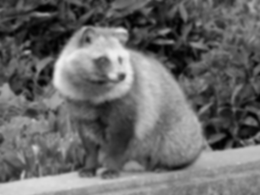 | 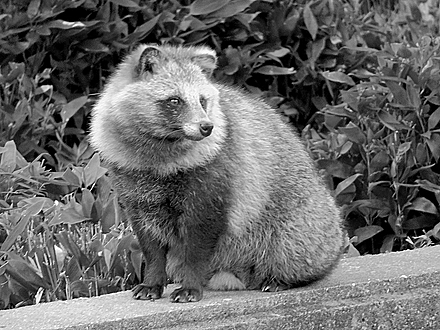 | 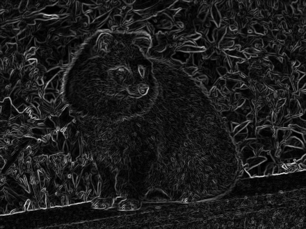 |
| `adj.blur(g, 4)` | `adj.sharpen(g, 1.5, 2)` | `adj.edges(g)` |

Adjustments compose — they're just functions:

```python
prepped = adj.gamma(adj.contrast(gray, 1.4), 0.9)
```

---

## 2. Colour separation

Split the image into named **ink-coverage planes**, each with a preview colour.
Below, every separation is screened with the default dot halftone (`cell=5`).

```python
from tanuki.mori.stencil_lab import separation as sep

s = sep.cmyk(rgb)                              # cyan / magenta / yellow / key
stencil = sl.build_stencil(s, (w, h), cell=5)  # one layer per channel
```

**`grayscale`** — single black plate:

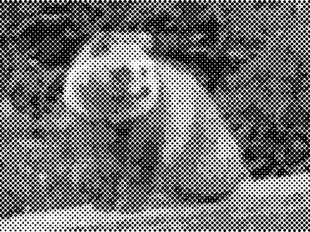

**`rgb`** — additive Red / Green / Blue:

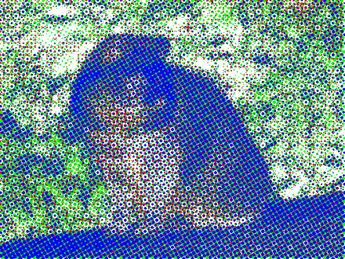

**`cmyk`** — process print. The composite, then **each plate on its own** (the
way it actually goes to press — one screen per ink, at its own angle
15° / 75° / 0° / 45°):

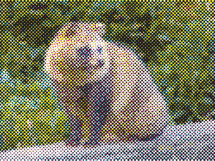

| Cyan (15°) | Magenta (75°) | Yellow (0°) | Key / black (45°) |
|:---:|:---:|:---:|:---:|
| 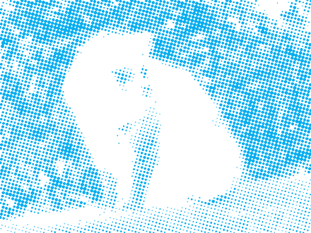 | 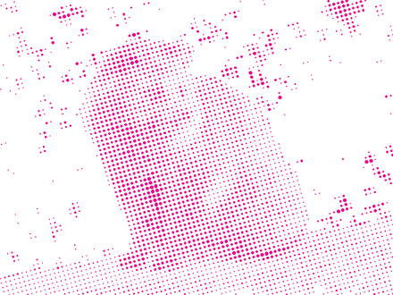 | 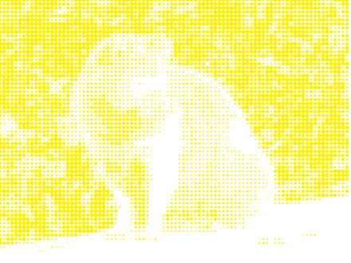 | 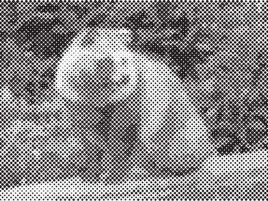 |

```python
# screen one plate on its own (each keeps its channel colour & angle)
key_plate = sl.build_stencil(sep.Separation([sep.cmyk(rgb)["key"]]), (w, h), cell=5)
```

**`duotone`** — riso two-colour, and **`tritone`** — shadow / mid / highlight:

| duotone | tritone |
|:---:|:---:|
| 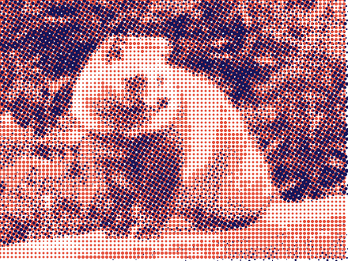 | 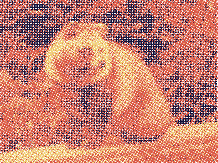 |

Each channel keeps its own coverage plane and preview colour:

```python
sep.cmyk(rgb)["key"].plane      # the K coverage array (H, W)
sep.cmyk(rgb)["cyan"].color     # (0, 174, 239)
```

---

## 3. Patterns

A pattern turns a coverage plane into vector geometry. All 16 below screen the
**grayscale** plane of the tanuki at `cell=5`. Swap with `pattern="…"` in
`build_stencil` / `halftone_stencil`, or call the generator directly.

### Traditional halftones

| `dots` | `lines` | `circular` | `crosshatch` |
|:---:|:---:|:---:|:---:|
|  | 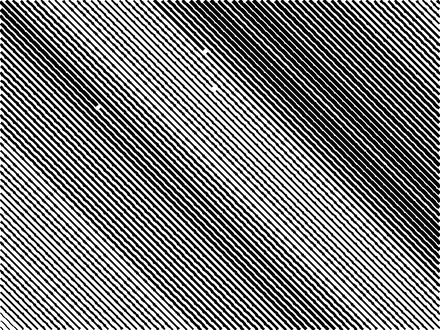 | 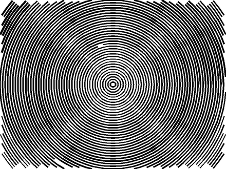 | 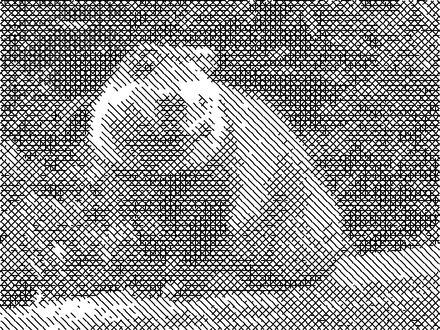 |
| area ∝ coverage | width ∝ coverage | concentric arcs | engraver build-up |

### Experimental screens

| `sine` | `zigzag` | `spiral` | `radial` |
|:---:|:---:|:---:|:---:|
| 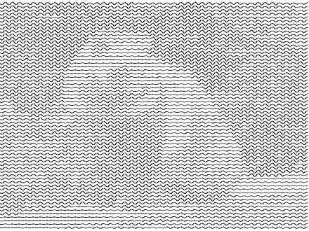 | 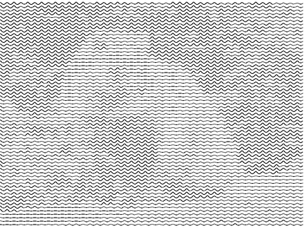 | 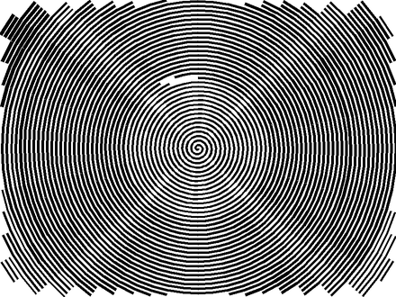 | 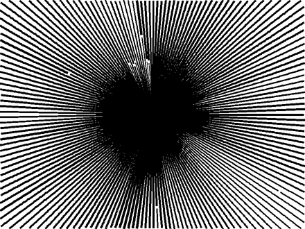 |
| amplitude ∝ coverage | triangle wave | one Archimedean spiral | rays from centre |

| `hexagons` | `honeycomb` | `topographic` | `stipple` |
|:---:|:---:|:---:|:---:|
|  | 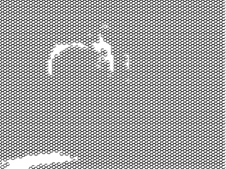 | 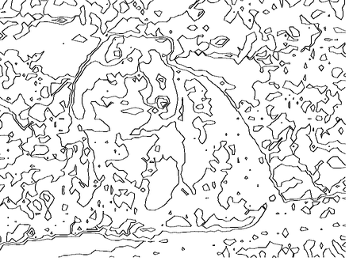 | 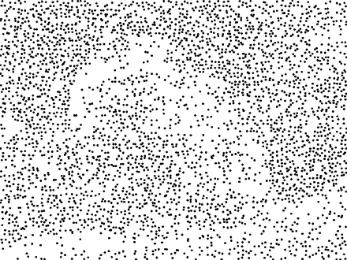 |
| hex cell ∝ coverage | hex mask | iso-coverage contours | random dots, density ∝ coverage |

| `voronoi` | `splotches` | `threshold_lines` | `line_screen` |
|:---:|:---:|:---:|:---:|
| 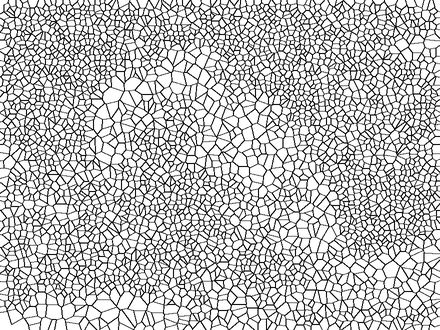 | 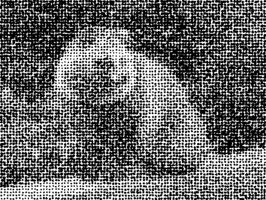 | 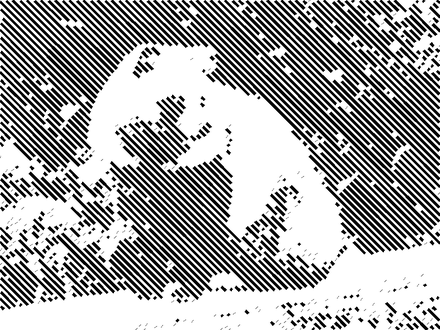 | 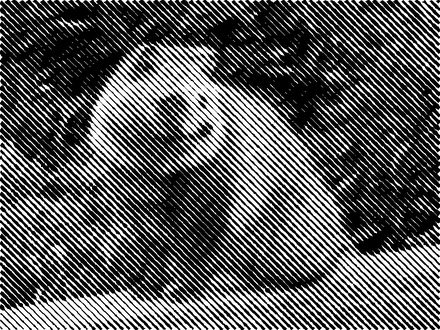 |
| cell density ∝ coverage | irregular ink blobs ∝ coverage (shadows, B&W) | threshold cut broken by a line carrier — **self-bridging** | continuous AM line ribbons (street-art look) |

`splotches` grows organic blobs with darkness for a hand-stippled / spray
shadow. `threshold_lines` is special: it cuts the dark regions only as line
**stripes**, leaving the gaps as material — so the result is always cuttable
(one part cut, the other always held). See §4 for the cuttability proof.

```python
# the easy way — image → screened, layered stencil → SVG
# (cut-optimized by default; pass optimize=False for the raw artistic pattern)
stencil = sl.halftone_stencil("tanuki.jpg", method="grayscale",
                              pattern="voronoi", cell=9)
sl.write_svg(stencil, "tanuki.svg", background="white")

# or call a generator directly for its full parameter set
plane = sep.grayscale(rgb)["key"].plane
dots  = sl.halftone_dots(plane, cell=6, angle=45, scale=1.0)
```

> The galleries above are shown **raw** (via `build_stencil`) to make each
> pattern legible. The one-shot `halftone_stencil` instead returns
> **cut-optimized** geometry by default — see §4.

### Recreating street-art line-screen stencils

The `line_screen` pattern exists to reproduce a specific real-world look: the
spray-stencil / paste-up portraits where the whole image is rendered as
**continuous horizontal lines that swell with darkness** (thin in highlights,
merging to solid in shadows). Reference photos live in [`refs/`](refs).

| Ref 3 — straight line stencil | Ref 2 — multi-layer colour | Ref 5 — **wavy** lines |
|:---:|:---:|:---:|
|  |  |  |

Recreated on the tanuki — a single-ink horizontal `line_screen`, a **duotone**
one (the multi-layer colour look of refs 2 & 4), then the same screen in **CMYK**
(each plate at its own angle) and **wavy** (ref 5), all at `angle=0` unless noted:

| `line_screen` (like ref 3) | duotone (like refs 2 & 4) | CMYK plates | wavy (like ref 5) |
|:---:|:---:|:---:|:---:|
| 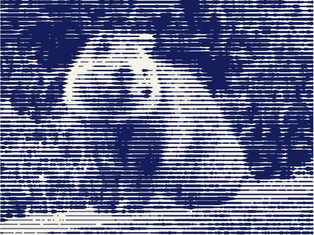 | 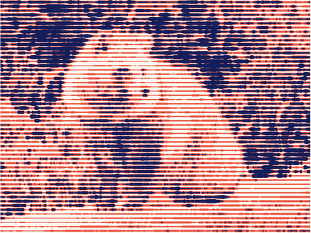 | 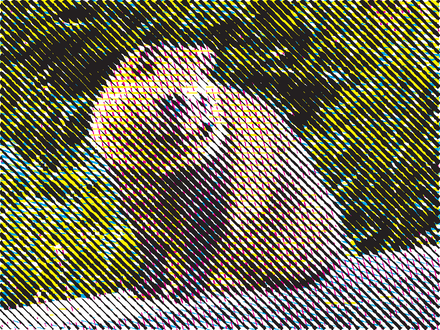 | 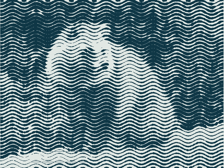 |

```python
g = sl.adjustments.contrast(sl.to_grayscale(rgb), 1.25)

# single-ink horizontal line stencil (ref 3)
ink = sl.Stencil(w, h)
ink.layer("ink", color=(20, 30, 90)).add(
    sl.line_screen(1 - g, period=6, angle=0, max_duty=0.95))
sl.write_svg(ink, "lines.svg", background="#f5f2e6")

# colour: screen each separation plate as its own line layer …
duo = sl.separation.duotone(rgb, shadow=(20, 30, 90), base=(235, 90, 70))
multi = sl.Stencil(w, h)
for ch in duo:
    multi.layer(ch.name, color=ch.color).add(
        sl.line_screen(ch.plane, period=6, angle=0, max_duty=0.95))

# … or let the pipeline screen CMYK as lines at the classic 15/75/0/45° angles
cmyk_lines = sl.build_stencil(sl.separation.cmyk(rgb), (w, h),
                              pattern="line_screen", cell=6)

# wavy lines (ref 5): undulate the track perpendicular to its travel
wave = sl.line_screen(1 - g, period=7, angle=0,
                      wave_amplitude=4, wave_length=46, max_duty=0.95)
```

`max_duty < 1` keeps a sliver of material between lines even in the blackest
areas, so the line-screen self-bridges and stays cuttable. `wave_amplitude`
(px) and `wave_length` (px) control the undulation — all lines wave in phase so
they stay parallel.

---

## 4. Fabrication & optimization

A real stencil is a sheet with material removed where ink passes. Model it as a
**`StencilMask`** (a cut/material raster) and make it fabrication-ready:
fill speckle, drop fragile fragments, and **bridge islands** (enclosed material
that would otherwise fall out — like the middle of an "O").

```python
from tanuki.mori.stencil_lab import fabrication as fab

poster = adj.posterize(adj.contrast(gray, 1.4), 2)     # crush to 2 tones
mask   = fab.StencilMask.from_coverage(1 - poster, threshold=0.5)
opt, report = fab.optimize_mask(mask, min_hole_area=8,
                                min_island_area=40, bridge_width=3)
print(report)
```

| Raw threshold mask | Optimised (speckle filled, islands bridged) |
|:---:|:---:|
| 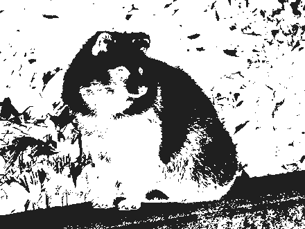 | 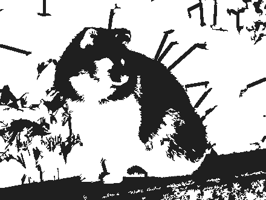 |

*(white = cut / hole, dark = material; the thin white strips in the right image
are the auto-generated bridges.)*

This run's report:

```
islands: 427 → 0  (removed 401, bridged 26)
small holes removed: 255
fabrication checks:
  ✓ has_material   ✓ islands   ✗ min_feature   ✓ min_hole
```

The optimised mask vectorises straight back for export (outer boundaries **and**
inner holes, as true rings):

```python
cut = opt.to_stencil(name="cut")
sl.write_dxf(cut, "cut.dxf")
```

### Can it be cut *without losing information*?

Before committing a sheet, ask the hard question: will every piece that should
stay actually hold? `analyze_cuttability` answers it topologically — it erodes
the material by the minimum feature size, anchors the cores that touch the
frame, and reconstructs which material is **robustly connected**. Whatever
isn't is **at-risk**: it would detach (an *island*) or tear off a too-thin
*weak neck* — either way that part of the image is lost.

```python
mask   = fab.StencilMask.from_stencil(dot_stencil)
report = fab.analyze_cuttability(mask, min_feature_px=2)
print(report)
report.cuttable          # True ⇒ cut as-is, nothing lost
report.score             # fraction of material that survives (1.0 = perfect)
report.regions           # every at-risk region: kind, area, bridgeable, …
```

Here is a plain **dot halftone** of the tanuki analysed at a 2-px minimum
feature — anchored material is dark, **at-risk material is red**:

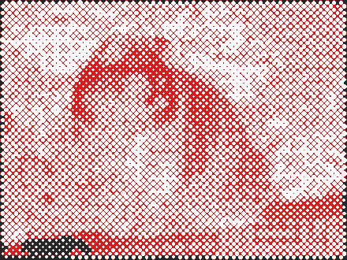

```
verdict: NOT directly cuttable
material anchored to frame: 5175/53540 px (9.7%)
at-risk material: 90.3% in 347 region(s) — 130 isolated, 217 weak-neck
  rescuable by bridges: 347/347
```

The verdict is honest and important: a photographic halftone is almost entirely
**not** a single-piece stencil — the web of material between dots detaches. Your
options, all measurable with this same report:

* **bridge it** — `optimize_mask` / `add_bridges` reconnect islands (at the cost
  of small marks across the holes); re-run `analyze_cuttability` to confirm the
  at-risk area drops;
* **pick a connected pattern** or **bolder art** — compare `report.score` across
  patterns/thresholds and choose one that holds together;
* **accept multi-piece** — cut and reassemble the pieces by hand.

CLI shortcut (exit code `0` = cuttable, `1` = not):

```bash
python -m tanuki.mori.stencil_lab tanuki.jpg --pattern dots --analyze --min-feature 2
```

---

## 5. Registration & multi-layer plates

Marks placed identically on every plate so colours line up on press. Three
kinds: `crosshair`, `target`, `corner`.

```python
sl.add_registration_marks(stencil, kind="target")
```

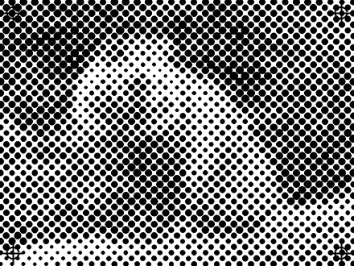

*(target marks sit just inside each corner)*

Explode a multi-ink design into one plate per channel — each carrying the marks
— to print/cut separately:

```python
cmyk = sl.build_stencil(sep.cmyk(rgb), (w, h), cell=5)
for plate in sl.split_to_plates(cmyk, kind="target"):
    sl.write_dxf(plate, f"plate_{plate.layers[0].name}.dxf")
```

---

## 6. Tiling for the plotter bed

When the design is bigger than the cutter's bed, panelise it. Each tile is
clipped exactly (Liang–Barsky for strokes, Sutherland–Hodgman for filled
polygons + holes, centre-membership for dots), given **crop marks**, and moved
to its own `(0, 0)` origin.

```python
tiles = sl.tile_stencil(stencil, bed_w, bed_h, overlap=20)   # → grid of tiles
for t in tiles:                                              # t.row / t.col
    sl.write_dxf(t.stencil, f"cut_{t.name}.dxf")             # cut_r0c0.dxf, …
```

Here the tanuki is split across a 2×2 bed (gaps and grey added for clarity):

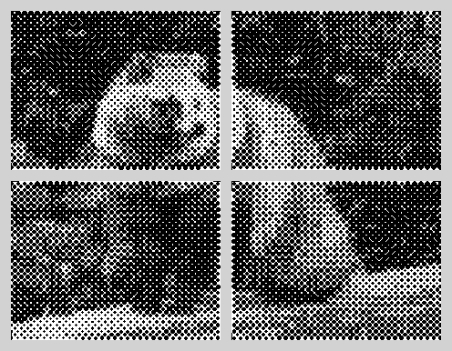

Set `overlap` ≥ your largest dot/stroke so nothing is lost at a seam.

### Physical size — print on real sheets (and pliegos)

Tiling above is in pixels; to print at a real **size** the geometry is scaled to
millimetres (`fit_to_physical`) — then SVG exports `mm`, PDF scales to points,
and DXF/STL are in mm, so everything prints 1:1. Bigger than your printer? Split
it across sheets with `poster` / `tile_to_paper` (A0–A6, carta, tabloid, and the
Latin-American **pliego** 70×100 cm and fractions).

```python
st = sl.halftone_stencil("tanuki.jpg", pattern="line_screen", cell=6)

# 1) just a real size — one big file
poster_mm = sl.fit_to_physical(st, width_mm=700)      # 70 cm wide, units="mm"
sl.write_svg(poster_mm, "poster.svg")                 # prints at 70 cm

# 2) how many sheets would it take?
sl.sheets_needed(poster_mm, "a4")        # → (cols, rows), e.g. (4, 2)
sl.sheets_needed(poster_mm, "pliego")    # → (1, 1)

# 3) split across sheets, sized by width or by sheet count
scaled, tiles = sl.poster(st, "a4", width_mm=420)     # ≈ A2 across A4 sheets
for t in tiles:                                       # each tile is in mm, 1:1
    sl.write_pdf(t.stencil, f"sheet_{t.name}.pdf")
```

A 420×315 mm line-screen tanuki tiled onto **6 A4 sheets** (each carries crop
marks; print, trim to the overlap and glue):

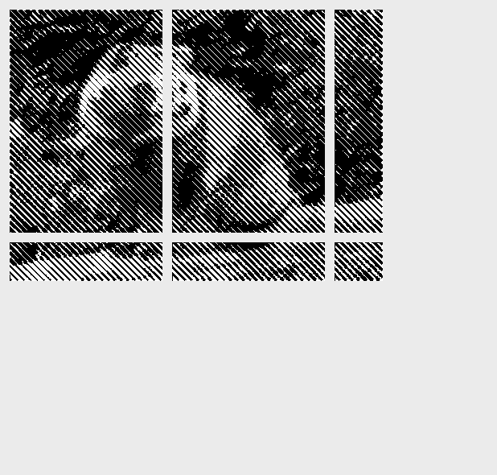

> Resolution is independent of size: the screen is generated in pixels
> (`max_side` / `cell` set the dot pitch), *then* scaled to mm — so a 70 cm
> poster and a 7 cm sticker can share the exact same artwork.
> `sl.px_for_print(longest_mm, dpi)` gives a pixel `max_side` for a target DPI.

CLI:

```bash
# one 70 cm-wide physical SVG
python -m tanuki.mori.stencil_lab tanuki.jpg --width-mm 700 -o poster.svg

# a 70 cm design split across A4 sheets as PDFs
python -m tanuki.mori.stencil_lab tanuki.jpg --width-mm 700 --paper a4 -f pdf -o sheet.pdf

# fit a single pliego (landscape)
python -m tanuki.mori.stencil_lab tanuki.jpg --paper pliego --landscape -f dxf
```

---

## 7. Export formats

The same `Stencil` writes to any of six formats — all dependency-free.

| Writer | Format | Vector? | Good for |
|---|---|:---:|---|
| `sl.write_svg`            | SVG | ✓ | preview, editing, most cutters |
| `sl.write_png`            | PNG | raster | proofing the composite |
| `sl.write_dxf`            | DXF (R12) | ✓ | laser / vinyl cutters, per-layer |
| `sl.write_pdf`            | PDF | ✓ | print-ready proofs |
| `sl.write_stl`            | STL | 3-D | 3-D-printing a physical plate |
| `sl.write_blender_script` | `.py` | 3-D | curves / extruded solids in Blender |

```python
sl.write_svg(stencil, "tanuki.svg", background="white")
sl.write_stl(stencil, "tanuki.stl", thickness=1.5)
```

---

## 8. One-liners (CLI)

```bash
# CMYK dot halftone → SVG
python -m tanuki.mori.stencil_lab tanuki.jpg --method cmyk --pattern dots --cell 5

# Voronoi screen → vector PDF
python -m tanuki.mori.stencil_lab tanuki.jpg -f pdf --method grayscale --pattern voronoi --cell 9

# 3-D-printable plate
python -m tanuki.mori.stencil_lab tanuki.jpg -f stl --thickness 1.5 --scale 0.1

# DXF with registration marks, split across a 600×800 plotter bed
python -m tanuki.mori.stencil_lab tanuki.jpg -f dxf --registration target \
    --tile 600x800 --tile-overlap 20
```

---

## 9. Web GUI

Prefer sliders to flags? There's an optional one-file **FastAPI** GUI:

```bash
# deps live with the lab (the tanuki core needs none of them)
pip install -r ../requirements-gui.txt            # or: pip install -e ".[gui]"
cd src/tanuki && python -m tanuki.mori.stencil_lab.gui   # → http://127.0.0.1:8000
```

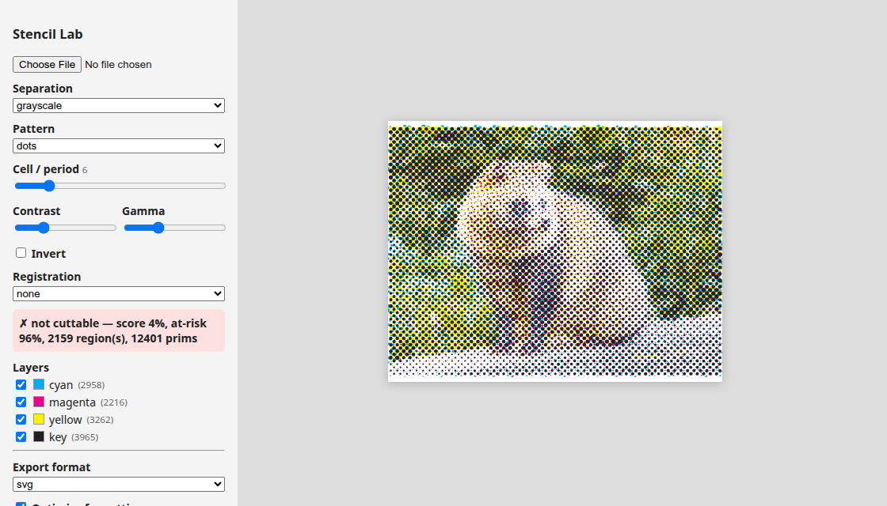

Upload a photo and the panel drives the same pipeline live:

* **Live vector preview** — the preview runs *un-optimised* at low resolution
  (~0.3 s) and returns inline **SVG**, so it stays crisp at any zoom.
* **Toggle colour plates** — each separation channel is an SVG `<g>` group, so
  the layer checkboxes show/hide plates instantly (no re-render).
* **Cuttability verdict** — the green/red bar is live `analyze_cuttability`
  (score, at-risk %, region count).
* **Export** — pick a format, optional **physical width (mm)** and **paper**
  size; the heavy cut-optimised render runs in the background and downloads a
  file (or a `.zip` of sheets for a poster).

It's pure glue over the library functions — see [`gui.py`](../gui.py) (the page
markup lives in [`gui_index.html`](../gui_index.html)).

---

See the [README](../README.md) for the module map and phase roadmap, and
[`usage.md`](usage.md) for the full API reference.
